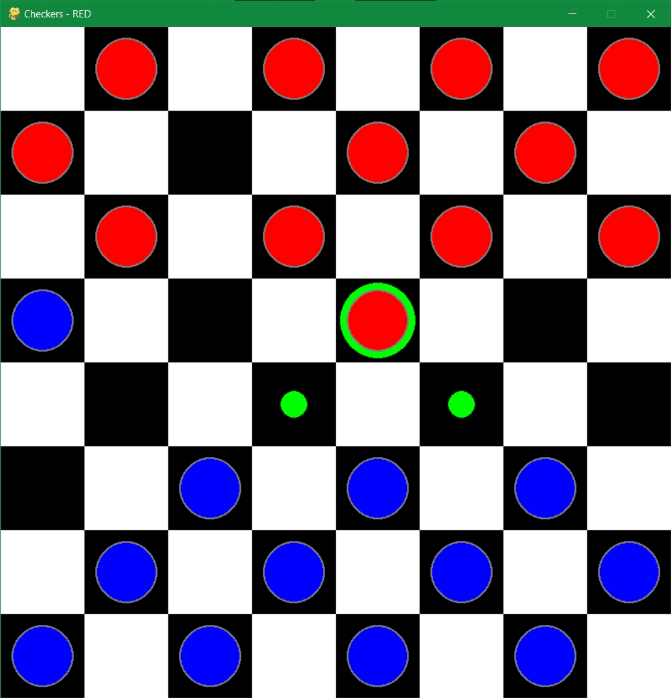
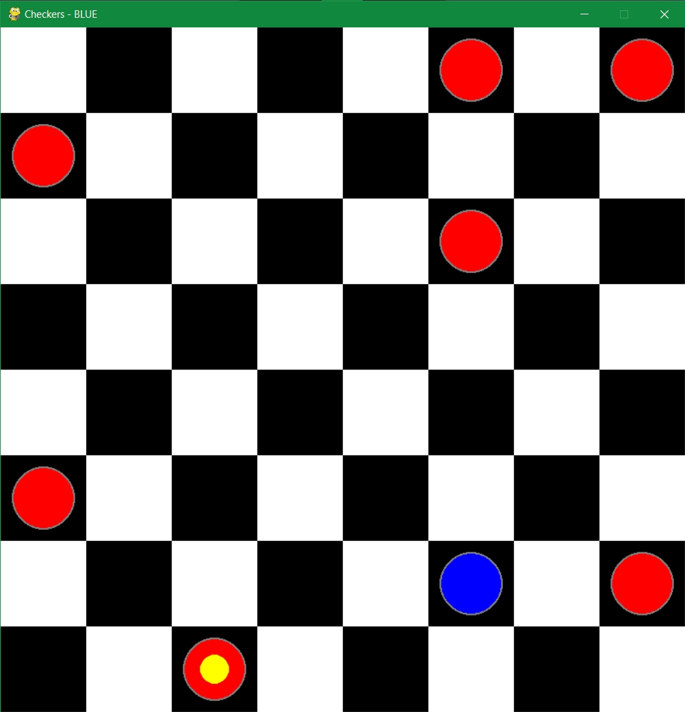

# Checkers-AI

Play checkers against an AlphaGo Zero-inspired AI!

This program uses reinforcement learning and the modified Monte Carlo Search Tree algorithm to play against human opponents. 

Built with:
-----------

- Python 3.9
- [imparaai-checkers](https://pypi.org/project/imparaai-checkers)
- Tensorflow & Keras
- numpy
- pygame

How to build & run:
-----------

Requirements:
- Python 3 (preferably 3.9, might work with other versions)
- Poetry tool for Python (```pip install poetry```)

Run the training session:
1. Run ```poetry install``` in the root directory.
2. Open poetry shell with ```poetry shell``` and run the launch_training.py script OR use ```poetry run python launch_training.py```.

Run the game:

Open poetry shell with ```poetry shell``` and run the main.py script OR use ```poetry run python main.py```.

Screenshots:
------------



